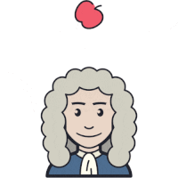

# flipbook
Designing a language for describing flipbooks and implementing a compiler for this language that can convert a flipbook description into a printable pdf (or a video)

## V1
Can parse the following format using python:
```html
<Canvas size>
<page range> <file name> <dimension> <start coordinate> <final coordinate>
.
.
```
eg. for the following images and `.flip` code


```
500 500
1 25 applePic.png 82 82 209 0 209 105
26 35 applePic.png 82 82 209 105 239 75
36 42 applePic.png 82 82 239 75 245 75
43 49 applePic.png 82 82 245 75 300 105
50 100 applePic.png 82 82 300 105 418 418
1 100 isaac-newtonPic.png 272 313 114 187 114 187
```
Output:


## V2
Added the functionality to choose between gif/pdf. The `.flip` code will be of following syntax:
```html
<format gif/pdf>
<Canvas size>
<page range> <file name> <dimension> <start coordinate> <final coordinate>
.
.
```

## Current functionalities
* Can move one image from one location to another.
* Can add multiple images and even overlap one over the another to create images.
* Can produce pdf/gif as output.
* Can change the frame size.
* Can specify the dimention of the image to be used (i.e. no need to resize beforehand)

## Future Implementations
* We can have more options for transitions, i.e. more options can be added like `ease`, `linear`, `ease-in`, `ease-in-out`, etc.
* We can add zooming effects as well (change dimension in each frame).
* We can add option for rotation of the image as well.
* We can optimise the size of the output gif and add option for selecting the background color.
* We can also add support to gif images as input as well.
* We can provide the functionality to create video as output also.
* Improve the readability of the `flip` codes.
